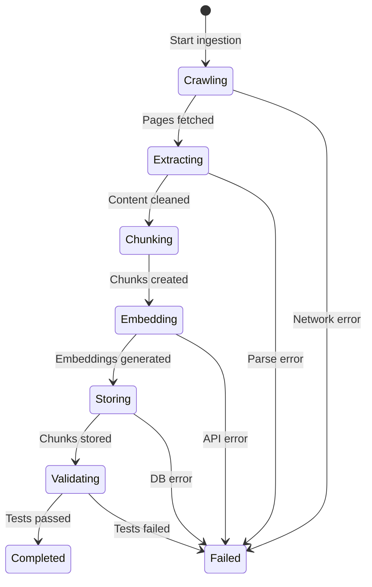

# Data Model: Documentation RAG Ingestion System

**Feature**: 001-doc-rag-ingestion
**Date**: 2025-12-27
**Phase**: 1 - Design & Contracts

This document defines all data structures used in the documentation ingestion pipeline, based on entities identified in [spec.md](spec.md) and technical decisions from [research.md](research.md).

---

## Table of Contents

1. [Entity Overview](#entity-overview)
2. [Entity Definitions](#entity-definitions)
3. [Data Flow](#data-flow)
4. [Validation Rules](#validation-rules)
5. [State Transitions](#state-transitions)

---

## Entity Overview

| Entity | Purpose | Lifecycle | Storage |
|--------|---------|-----------|---------|
| **DocumentationPage** | Represents a crawled webpage | Created during crawl → Processed → Chunked | In-memory (transient) |
| **TextChunk** | Segment of processed documentation | Created during chunking → Embedded → Stored | Qdrant (persistent) |
| **EmbeddingVector** | Numerical vector representation | Generated from chunk → Stored with chunk | Qdrant (persistent) |
| **IngestionMetadata** | Tracks entire ingestion run | Created at start → Updated during pipeline → Finalized at end | In-memory + logs |

---

## Entity Definitions

### 1. DocumentationPage

Represents a single page from the documentation website.

```python
from dataclasses import dataclass
from datetime import datetime
from typing import Optional, Dict, Any

@dataclass
class DocumentationPage:
    """
    A single crawled documentation page.

    Lifecycle: Created during crawl → Processed → Chunked → Discarded
    """

    # Identification
    url: str                          # Full URL (normalized, no anchors/query params)
    page_id: str                      # SHA256 hash of URL (for deduplication)

    # Content
    raw_html: str                     # Original HTML content
    cleaned_text: str                 # Extracted text after removing navigation/footers
    title: str                        # Page title (<title>, <og:title>, or <h1>)
    description: Optional[str]        # Meta description if available

    # Metadata
    crawled_at: datetime              # Timestamp when page was fetched
    content_hash: str                 # SHA256 of cleaned_text (for content dedup)
    content_length: int               # Character count of cleaned_text
    http_status: int                  # HTTP status code (200, 404, etc.)

    # Extraction metadata
    main_content_selector: str        # Which CSS selector found main content
    removed_elements_count: int       # How many nav/footer elements removed

    # Docusaurus-specific (optional)
    breadcrumb: Optional[str]         # Navigation breadcrumb
    last_modified: Optional[datetime] # From Docusaurus metadata
    section: Optional[str]            # Primary section (docs, blog, tutorial)

    # Processing state
    processed: bool = False           # Has been chunked
    chunks_created: int = 0           # Number of chunks created from this page

    def __post_init__(self):
        """Validate required fields"""
        assert self.url.startswith('http'), "URL must be absolute"
        assert len(self.cleaned_text) > 0, "Cleaned text cannot be empty"
        assert self.http_status == 200, f"Only successful pages (got {self.http_status})"


@dataclass
class PageExtractionResult:
    """Result of extracting content from HTML"""
    success: bool
    page: Optional[DocumentationPage]
    error: Optional[str]
    extraction_metadata: Dict[str, Any]  # Selector used, elements removed, etc.
```

**Validation Rules**:
- `url` must be absolute (starts with http/https)
- `url` must be normalized (no trailing slash, anchors, or query params)
- `cleaned_text` must have at least 100 characters (meaningful content)
- `http_status` must be 200 (only successful fetches)
- `content_hash` must be unique within ingestion run (no duplicate content)

**Example**:
```python
page = DocumentationPage(
    url="https://hackathon-1-eight-pi.vercel.app/docs/intro",
    page_id="e3b0c44298fc1c14...",
    raw_html="<!DOCTYPE html>...",
    cleaned_text="Welcome to our documentation...",
    title="Introduction - Documentation",
    description="Getting started guide",
    crawled_at=datetime.utcnow(),
    content_hash="9f86d081884c7d65...",
    content_length=5234,
    http_status=200,
    main_content_selector="article",
    removed_elements_count=12,
    breadcrumb="Home > Docs > Introduction",
    processed=False,
    chunks_created=0
)
```

---

### 2. TextChunk

Represents a segment of processed documentation text.

```python
@dataclass
class TextChunk:
    """
    A semantically meaningful segment of documentation.

    Lifecycle: Created during chunking → Embedded → Stored in Qdrant
    """

    # Identification
    chunk_id: str                     # UUID v4 (unique across all chunks)
    source_page_id: str               # References DocumentationPage.page_id

    # Content
    text: str                         # Chunk text content
    char_count: int                   # Character count
    token_count: int                  # Estimated token count (chars / 5)

    # Position within page
    chunk_index: int                  # Position in page (0-indexed)
    total_chunks_in_page: int         # Total chunks from parent page

    # Context metadata (from parent page)
    source_url: str                   # Full URL of source page
    page_title: str                   # Title of parent page
    section_heading: Optional[str]    # Nearest H1/H2/H3 heading
    heading_hierarchy: list[str]      # Breadcrumb of headings (e.g., ["Setup", "Auth", "API Keys"])
    breadcrumb: Optional[str]         # Navigation breadcrumb

    # Content classification
    content_type: str                 # "text", "code", "list", "table", "mixed"
    has_code: bool                    # Contains code blocks
    language: str = "en"              # Content language

    # Timestamps
    created_at: datetime              # When chunk was created

    # Linking (for context continuity)
    prev_chunk_id: Optional[str]      # Previous chunk from same page
    next_chunk_id: Optional[str]      # Next chunk from same page

    # Embedding (populated after embedding generation)
    embedding: Optional[list[float]] = None  # Vector embedding (1024 dims)
    embedding_model: str = "embed-english-v3.0"
    embedded_at: Optional[datetime] = None

    # Storage (populated after Qdrant upload)
    stored: bool = False
    qdrant_point_id: Optional[str] = None  # UUID in Qdrant

    def __post_init__(self):
        """Validate chunk constraints"""
        assert 100 <= self.token_count <= 512, f"Token count {self.token_count} out of range [100, 512]"
        assert len(self.text.strip()) > 0, "Chunk text cannot be empty"
        assert self.chunk_index >= 0, "Chunk index must be non-negative"
        assert self.content_type in ["text", "code", "list", "table", "mixed"], "Invalid content type"

    def to_qdrant_payload(self) -> Dict[str, Any]:
        """Convert to Qdrant payload format"""
        return {
            "chunk_id": self.chunk_id,
            "source_url": self.source_url,
            "page_title": self.page_title,
            "chunk_text": self.text,
            "chunk_index": self.chunk_index,
            "chunk_size": self.char_count,
            "section_heading": self.section_heading,
            "breadcrumb": self.breadcrumb,
            "heading_hierarchy": self.heading_hierarchy,
            "content_type": self.content_type,
            "has_code": self.has_code,
            "ingested_at": self.created_at.isoformat(),
            "content_hash": self.get_content_hash(),
            "embedding_model": self.embedding_model,
            "prev_chunk_id": self.prev_chunk_id,
            "next_chunk_id": self.next_chunk_id,
        }

    def get_content_hash(self) -> str:
        """Generate SHA256 hash of chunk text"""
        import hashlib
        return hashlib.sha256(self.text.encode('utf-8')).hexdigest()
```

**Validation Rules**:
- `token_count` must be between 100 and 512 (model limits)
- `text` must contain at least 20 words (minimum meaningful content)
- `chunk_index` must be 0 or positive
- `content_type` must be one of: "text", "code", "list", "table", "mixed"
- `embedding` (when populated) must have exactly 1024 dimensions

**Example**:
```python
chunk = TextChunk(
    chunk_id="550e8400-e29b-41d4-a716-446655440000",
    source_page_id="e3b0c44298fc1c14...",
    text="To authenticate API requests, include your API key in the Authorization header...",
    char_count=487,
    token_count=97,  # Estimated: 487 / 5
    chunk_index=2,
    total_chunks_in_page=8,
    source_url="https://hackathon-1-eight-pi.vercel.app/docs/api-reference",
    page_title="API Reference - Authentication",
    section_heading="Authentication Methods",
    heading_hierarchy=["API Reference", "Authentication", "Methods"],
    breadcrumb="Home > API > Authentication",
    content_type="text",
    has_code=False,
    created_at=datetime.utcnow(),
    prev_chunk_id="550e8400-e29b-41d4-a716-446655440001",
    next_chunk_id="550e8400-e29b-41d4-a716-446655440003",
)
```

---

### 3. EmbeddingVector

Represents the numerical vector representation of a text chunk.

```python
@dataclass
class EmbeddingVector:
    """
    Vector embedding of a text chunk.

    Lifecycle: Generated from TextChunk → Stored in Qdrant
    Note: In practice, this is stored as part of TextChunk, not separately.
    """

    # Identification
    chunk_id: str                     # References TextChunk.chunk_id

    # Vector data
    vector: list[float]               # Embedding vector (1024 dimensions)
    dimensions: int                   # Vector dimensions (1024)

    # Generation metadata
    model: str                        # "embed-english-v3.0"
    input_type: str                   # "search_document"
    generated_at: datetime            # When embedding was created

    # API metadata (for debugging)
    api_request_id: Optional[str]     # Cohere API request ID
    generation_time_ms: Optional[int] # How long embedding took

    def __post_init__(self):
        """Validate vector"""
        assert len(self.vector) == self.dimensions, f"Vector size mismatch: {len(self.vector)} != {self.dimensions}"
        assert self.dimensions == 1024, "Must use 1024-dim Cohere embeddings"
        assert all(isinstance(x, float) for x in self.vector), "Vector must contain floats"
```

**Validation Rules**:
- `vector` must have exactly 1024 elements (Cohere embed-english-v3.0 dimension)
- All vector elements must be floats (not integers or other types)
- `model` must be "embed-english-v3.0" (enforces consistency)
- `input_type` must be "search_document" (optimized for document embedding)

**Note**: In implementation, embedding vector is stored as a property of `TextChunk` rather than a separate entity, but this definition clarifies the structure and validation rules.

---

### 4. IngestionMetadata

Tracks the entire ingestion run.

```python
@dataclass
class IngestionMetadata:
    """
    Metadata for an entire ingestion run.

    Lifecycle: Created at pipeline start → Updated during processing → Finalized at end
    """

    # Identification
    run_id: str                       # UUID v4 (unique per ingestion run)
    base_url: str                     # Documentation site base URL

    # Timestamps
    started_at: datetime
    completed_at: Optional[datetime] = None
    duration_seconds: Optional[float] = None

    # Configuration (snapshot of parameters used)
    config: Dict[str, Any] = None     # Chunking config, embedding model, etc.

    # Progress tracking
    status: str = "running"           # "running", "completed", "failed", "partial"

    # Crawling metrics
    urls_discovered: int = 0          # Total URLs found
    urls_crawled: int = 0             # URLs successfully fetched
    urls_failed: int = 0              # URLs that returned errors
    urls_skipped: int = 0             # Filtered out or deduplicated

    # Processing metrics
    pages_processed: int = 0          # Pages successfully cleaned and chunked
    chunks_created: int = 0           # Total chunks created
    chunks_embedded: int = 0          # Chunks with embeddings
    chunks_stored: int = 0            # Chunks stored in Qdrant

    # Error tracking
    errors: list[Dict[str, Any]] = None  # List of errors encountered
    warnings: list[str] = None           # Non-fatal warnings

    # Validation results
    validation_passed: bool = False
    validation_queries: int = 0       # Number of test queries run
    validation_success_rate: float = 0.0  # Percentage of successful retrievals

    # Resource usage (optional)
    api_calls_cohere: int = 0
    api_calls_qdrant: int = 0
    total_bytes_crawled: int = 0

    def __post_init__(self):
        if self.config is None:
            self.config = {}
        if self.errors is None:
            self.errors = []
        if self.warnings is None:
            self.warnings = []

    def finalize(self):
        """Mark ingestion as complete and calculate final metrics"""
        self.completed_at = datetime.utcnow()
        self.duration_seconds = (self.completed_at - self.started_at).total_seconds()

        if self.urls_failed == 0 and self.chunks_stored == self.chunks_created:
            self.status = "completed"
        elif self.chunks_stored > 0:
            self.status = "partial"
        else:
            self.status = "failed"

    def add_error(self, stage: str, error: str, details: Optional[Dict] = None):
        """Record an error"""
        self.errors.append({
            "timestamp": datetime.utcnow().isoformat(),
            "stage": stage,
            "error": error,
            "details": details or {}
        })

    def to_summary(self) -> Dict[str, Any]:
        """Generate summary report"""
        return {
            "run_id": self.run_id,
            "base_url": self.base_url,
            "status": self.status,
            "duration_seconds": self.duration_seconds,
            "metrics": {
                "urls_crawled": self.urls_crawled,
                "pages_processed": self.pages_processed,
                "chunks_created": self.chunks_created,
                "chunks_stored": self.chunks_stored,
                "success_rate": self.chunks_stored / self.chunks_created if self.chunks_created > 0 else 0
            },
            "errors": len(self.errors),
            "warnings": len(self.warnings),
            "validation": {
                "passed": self.validation_passed,
                "queries": self.validation_queries,
                "success_rate": self.validation_success_rate
            }
        }
```

**Validation Rules**:
- `run_id` must be unique UUID v4
- `started_at` must be set at initialization
- `status` must be one of: "running", "completed", "failed", "partial"
- Counters (`urls_crawled`, `chunks_created`, etc.) must be non-negative
- `duration_seconds` can only be set when `completed_at` is set

---

## Data Flow

### Pipeline Flow

```
1. CRAWL
   Input: base_url (str)
   Output: List[DocumentationPage]

2. CLEAN & EXTRACT
   Input: List[DocumentationPage]
   Output: List[DocumentationPage] (with cleaned_text)

3. CHUNK
   Input: List[DocumentationPage]
   Output: List[TextChunk]

4. EMBED
   Input: List[TextChunk]
   Output: List[TextChunk] (with embeddings)

5. STORE
   Input: List[TextChunk] (with embeddings)
   Output: Success/failure status

6. VALIDATE
   Input: Qdrant collection
   Output: IngestionMetadata (with validation results)
```

### State Transitions



### Entity Relationships

```
DocumentationPage (1) ---> (N) TextChunk
  - One page produces multiple chunks
  - page_id links to source_page_id

TextChunk (1) ---> (1) EmbeddingVector
  - Each chunk has one embedding
  - Stored together in Qdrant

IngestionMetadata (1) ---> (N) DocumentationPage
  - One run processes multiple pages
  - run_id tracked in logs
```

---

## Validation Rules

### DocumentationPage Validation
```python
def validate_page(page: DocumentationPage) -> bool:
    checks = [
        page.url.startswith('http'),
        len(page.cleaned_text) >= 100,
        page.http_status == 200,
        page.content_length > 0,
        len(page.content_hash) == 64,  # SHA256
    ]
    return all(checks)
```

### TextChunk Validation
```python
def validate_chunk(chunk: TextChunk) -> bool:
    checks = [
        100 <= chunk.token_count <= 512,
        len(chunk.text.split()) >= 20,  # Min 20 words
        chunk.chunk_index >= 0,
        chunk.content_type in ["text", "code", "list", "table", "mixed"],
        (chunk.embedding is None) or (len(chunk.embedding) == 1024),
    ]
    return all(checks)
```

### EmbeddingVector Validation
```python
def validate_embedding(embedding: EmbeddingVector) -> bool:
    checks = [
        len(embedding.vector) == 1024,
        all(isinstance(x, float) for x in embedding.vector),
        embedding.model == "embed-english-v3.0",
        embedding.input_type == "search_document",
    ]
    return all(checks)
```

---

## State Transitions

### DocumentationPage States
```
CRAWLED (http_status=200, raw_html populated)
    ↓
EXTRACTED (cleaned_text populated, navigation removed)
    ↓
CHUNKED (processed=True, chunks_created > 0)
    ↓
DISCARDED (in-memory only, not persisted)
```

### TextChunk States
```
CREATED (text, metadata populated)
    ↓
EMBEDDED (embedding populated, embedded_at set)
    ↓
STORED (stored=True, qdrant_point_id set)
```

### IngestionMetadata States
```
RUNNING (status="running", started_at set)
    ↓
COMPLETED (status="completed", all metrics final)
    or
FAILED (status="failed", errors populated)
    or
PARTIAL (status="partial", some chunks stored)
```

---

## Summary

**Total Entities**: 4 (DocumentationPage, TextChunk, EmbeddingVector, IngestionMetadata)

**Persistent Storage**:
- Qdrant: TextChunk + EmbeddingVector (combined as Qdrant points)
- Logs: IngestionMetadata (as JSON summary)
- In-memory only: DocumentationPage (transient during processing)

**Key Constraints**:
- Chunks: 100-512 tokens, minimum 20 words
- Embeddings: Exactly 1024 dimensions (Cohere embed-english-v3.0)
- URLs: Normalized (no trailing slash, anchors, or query params)
- Content: No duplicate content_hash within ingestion run

**Data Size Estimates** (for 50,000 chunks):
- Vector storage: 50K × 4KB = 200MB
- Payload storage: 50K × 2KB = 100MB
- Total Qdrant: ~300MB (30% of free tier)

---

**Design Completed**: 2025-12-27
**Ready for Implementation**: Yes
